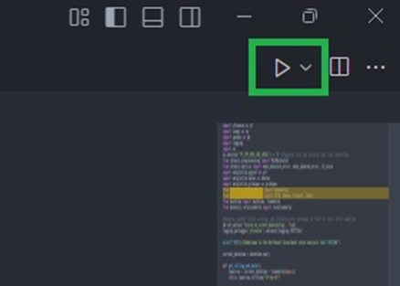
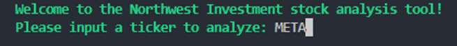
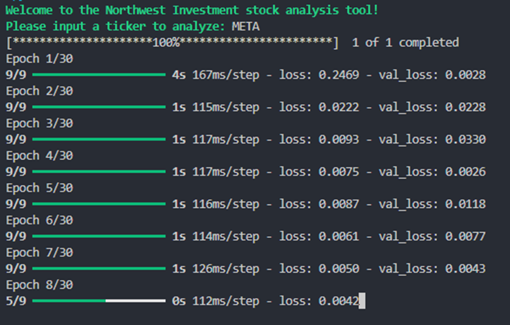
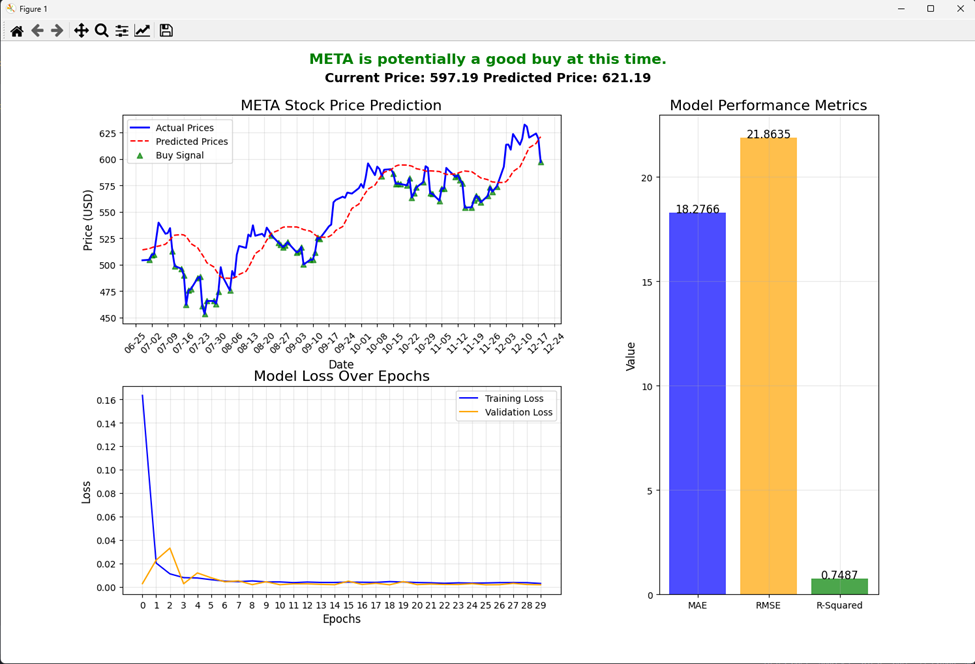

# Stock-Price-Prediction-ML
Using a LSTM Machine Learning model to evaluate individual stocks for buy signal

#User Guide:
In order to install and run this application, the following prerequisites softwares and libraries must be installed on your machine:
•	Python 3
•	Pip (Python package installer)
•	Python libraries:
o	yfinance
o	numpy
o	pandas
o	sklearn
o	matplotlib
o	tensorflow

These libraries can all easily be installed by navigating to a terminal or command prompt and running this code snippet: 
`pip install yfinance numpy pandas scikit-learn matplotlib tensorflow`

It is also recommended to use VSCode IDE to run this application. VSCode can be downloaded here:
https://code.visualstudio.com/download

Once the necessary software is downloaded:
1.	Open a terminal or  command prompt and navigate to the project directory
2.	Open the project within VSCode (or chosen IDE).
3.	Open the “LSTM Stock Prediction Model.py” file, and run it. In VSCode this can be done by clicking the triangle in the top right corner of the window, seen below:

4.	The program will prompt you to enter a stock ticker. For example we will use “META” which is Meta’s (formerly Facebook) stock ticker:

5.	Press the enter key and the application will run:

6.	Once complete, the stock analysis dashboard should open (*If the dashboard doesn’t immediately appear, check your minimized tabs to locate the new dashboard tab and open it):

7.	Repeat steps 3-6 as required to analyze more stocks.